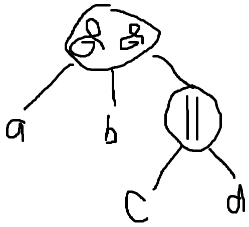

# Queries

## Logically connecting queries

Queries consist of trees which are grouped logically. All leaf's are a query itself, while nodes are logical groupings of queries. Assuming the queries a, b, c, and d, the organization is shown below:

a && b && (c || d)



A single query with no logical operators can be its own node. 

Logical operators:

* `and`: returns the intersection of all queries.
* `or`: returns the union of all queries.
* `not`: returns the complement of all queries. This is a special case because it can only operate on a single query. Thus it can only have one child, which is either a query o a logical operator.

## Query Format

A query, or a leaf node in the graph model, at its most basic is a parameter and then arguments on how the parameter should be searched. It consists of a parameter being given, and then for that parameter a list of values to match and how those values are logically connected. A simple example looks like this: 
```
{
	"source_type" : {
		"matches" : "facebook"
	}
}
```

If we wanted so search for all alerts that come from both facebook and twitter, there are two ways we can do this. We could use fully expanded search trees with the logical or operator, like below. Note how the root contains an operator and then a list of queries. Each of the queries are in the same format as the one shown above.
```
{
	"operator" : "or",
	"queries" : [
		{
			"source_type" : {
				"matches" : "facebook"
			}
		},
		{
			"source_type" : {
				"matches" : "twitter"
			}
		},
	],
}
```

However, for long lists this can get very annoying and hard to read, so there is a syntactical shorthand that can be used where within the parameter an operator is given and then a list of values. The above and below queries are equivalent.
```
{
	"source_type" : {
		"operator" : "or",
		"matches" : ["twitter", "facebook"]
	}
}
```

The logical tree search structure can also be used to query according to multiple parameters.
```
{
	"operator" : "and",
	"queries" : [
		{
			"source_type" : {
				"matches" : "twitter"
			}
		},
		{
			"country" : {
				operator = "not",
				"matches" : ["Mexico", "Puerto Rico"]
			}
		}
	]
}
```

Some operators have special ways they can be searched besides by `matches`. The special keywords are shown below.

### `contains`

For both the `location_name` and `tags` properties, they can be searched based on whether or not they contain a string. The example below returns all objects that have a tag containing the word 'city'.

```
{
	"tags" : {
		"contains" : "city"
	}
}
```

### `within`

This one is unique to the `date_created` parameter. It's used to get all alerts that were created between, or within, two dates. Example:

```
{
	"date_created" : {
		"within" : ["2018-12-19 00:00:00", "2019-11-19 00:00:00"]
	}
}
```

### `precision`

This keyword applies for the `geo_location` parameter. For GPS coordinates, it's often unwieldy to search for exact coordinates. Instead, you can search to within a certain decimal precision. The example below searches to the second decimal place, so the coordinates (30.1234, 30.5678) would be treated as (30.12, 30.57) for the purposes of the search. Note that the numbers do get rounded.

```
{
	"geo_location" : {
		"precision" : 2,
		operator : "or",
		"matches" : [(28.45, 42.11), (11.11, 12.12), (16.25, 25.16)]
	}
}
```